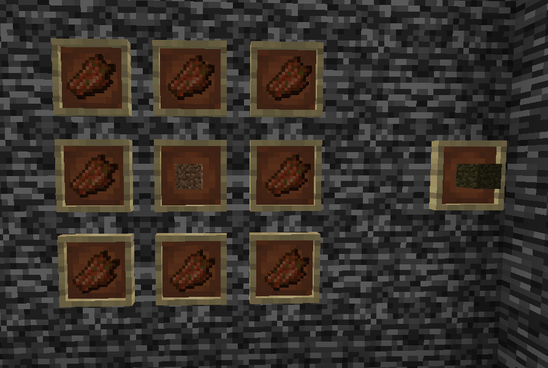
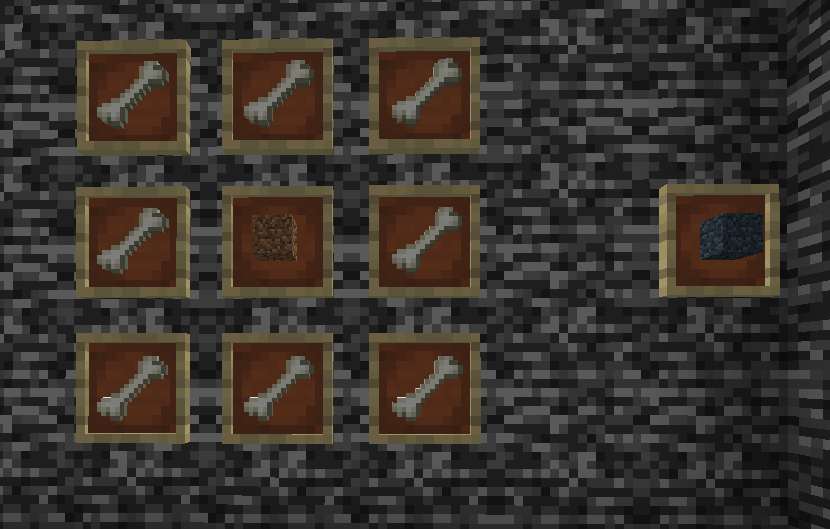

# Combat Enchantment Mob 

CEM is a Minecraft Mod made for 1.20.1, 
it gives to you the opportunity to have enchanted books with some items from mobs :).

# Documentation

## Enchanted Books

You have not all every enchanted books available ! 

List of enchanted books available : 
- Sharpness I
- Knockback I
- Protection I
- Unbreaking I
- Looting I
- Power I
- Fire Protection I
- Fire Aspect I
- Flame I

To get these books, you will have to craft some items and create the main block to "transform" your item.

## Controller

The controller is the block that will give you the permission to have the enchanted book selected from the item given.

### Craft 

Items/Blocks required : 
- 4 Zomb Dirt
- 4 Skel Dirt
- 1 Diamond

### How to use it 

Do a right click on it with your item crafted.

## Zomb Dirt 

### Craft 

Items required : 8 rotten flesh + 1 dirt

## Skel Dirt

### Craft

Items required : 8 bones + 1 dirt

## Blaze Dirt

### Craft

Items required : 8 blaze rods + 1 dirt