# Combat Enchantment Mob 

CEM is a Minecraft Mod made for 1.20.1, 
it gives to you the opportunity to have enchanted books with some items from mobs :).

# Documentation

## Enchanted Books

You have not all every enchanted books available ! 

List of enchanted books available : 
- Sharpness I
- Knockback I
- Protection I
- Unbreaking I
- Looting I
- Power I
- Fire Protection I
- Fire Aspect I
- Flame I

To get these books, you will have to craft some items and create the main block to "transform" your item.

## Controller

The controller is the block that will give you the permission to have the enchanted book selected from the item given.

### Craft 

Items/Blocks required : 
- 3 Zomb Dirt
- 3 Skel Dirt
- 2 Blaze Dirt
- 1 Diamond

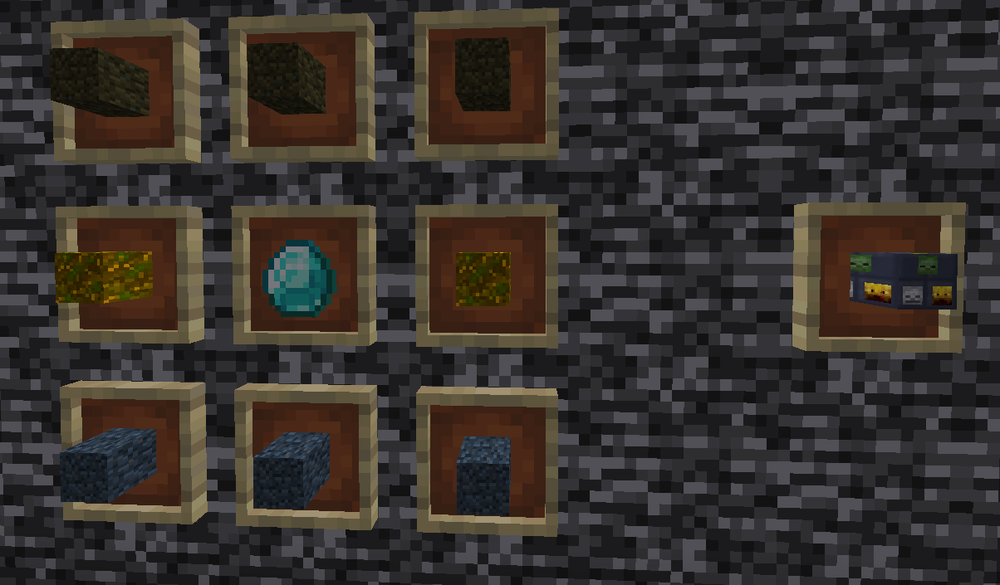

### How to use it 

Do a right click on it with your item crafted.

## Zomb Dirt

Items required : 8 rotten flesh + 1 dirt

## Skel Dirt

Items required : 8 bones + 1 dirt

## Blaze Dirt

Items required : 8 blaze rods + 1 dirt

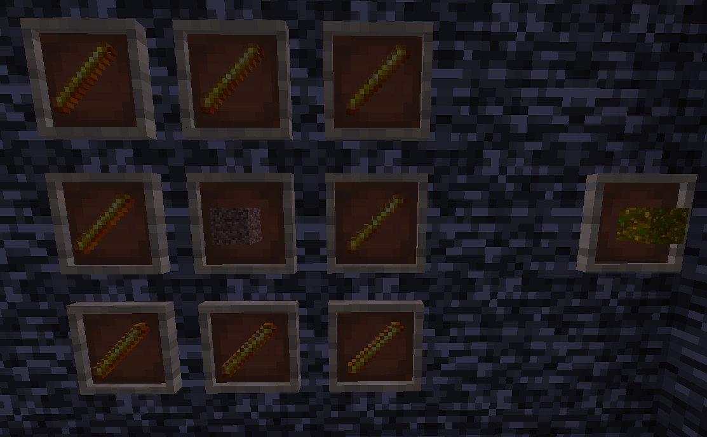

## Sharpness Zomb

Items required : 4 rotten flesh + 1 diamond sword

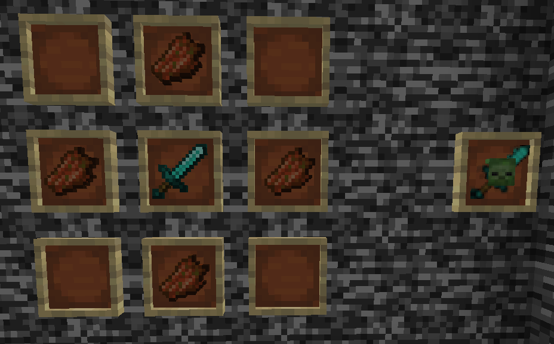

## Protection Zomb

Items required : 4 rotten flesh + 1 diamond chestplate

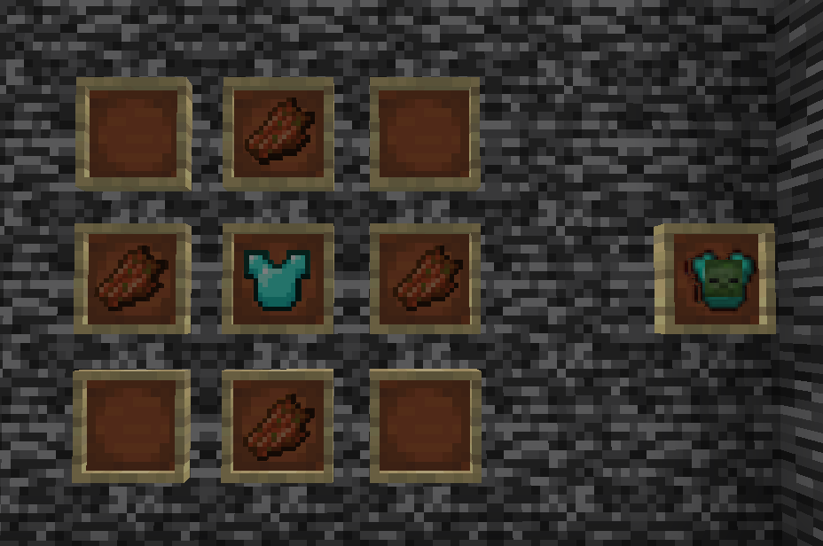

## Knockback Zomb

Items required : 4 rotten flesh + 1 stick

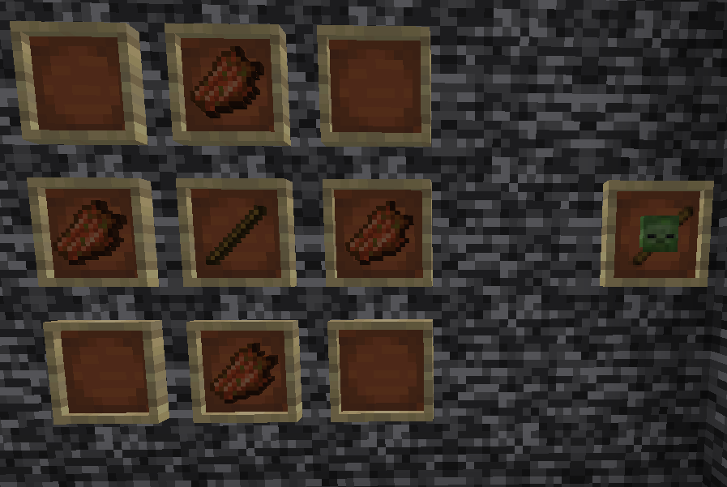

## Unbreaking Skel

Items required : 4 bone + 1 anvil

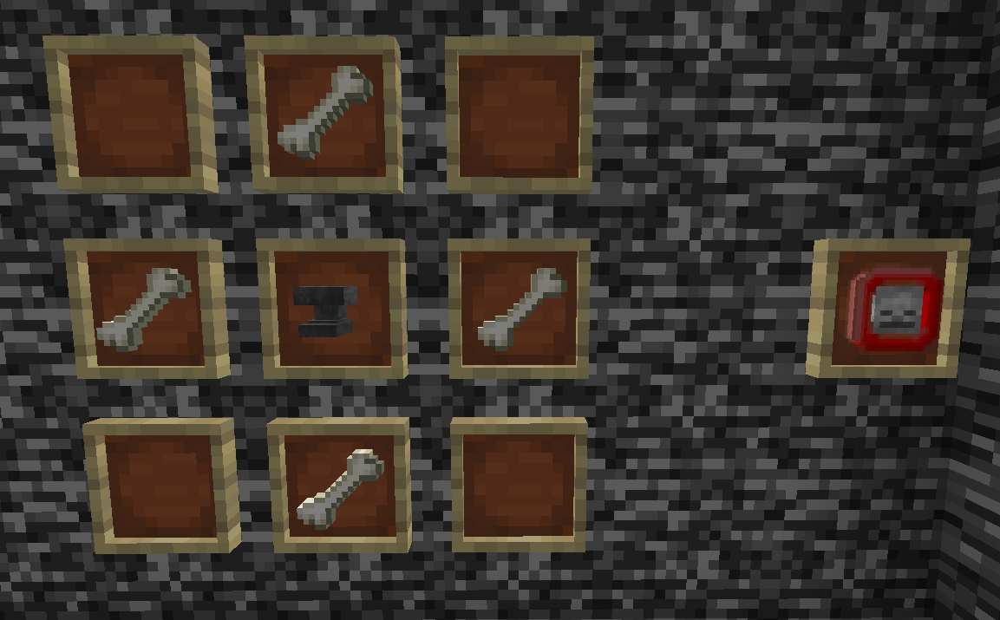

## Looting Skel

Items required : 4 bone + 1 diamond shovel

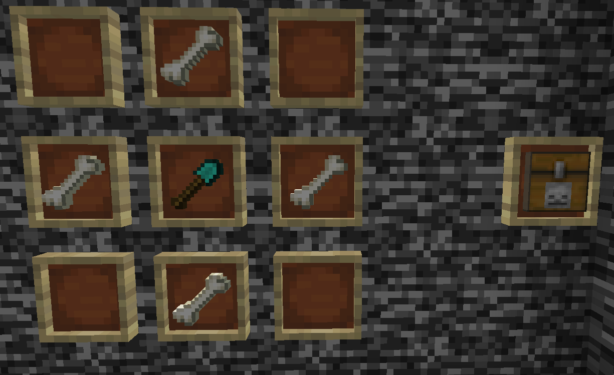

## Power Skel

Items required : 4 bone + 1 bow

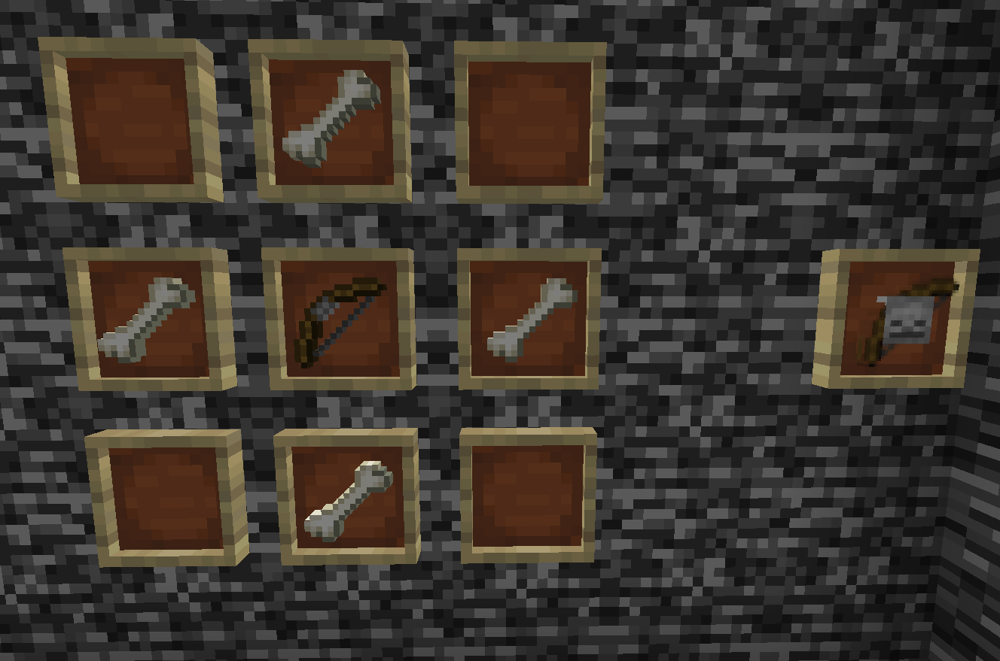

## Fire Protection Blaze

Items required : 4 blaze rod + 1 lava bucket

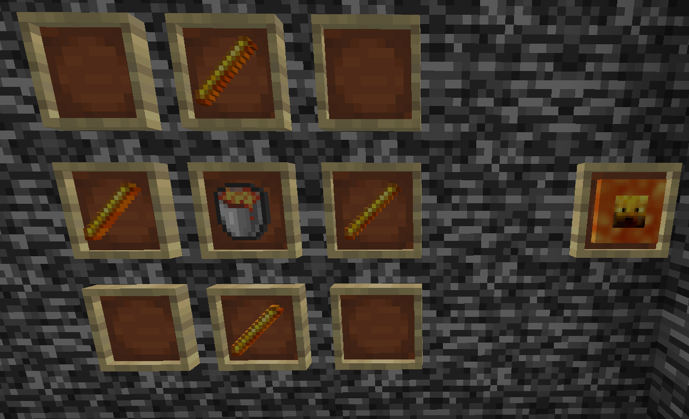

## Fire Aspect Blaze

Items required : 4 blaze rod + 1 fint and steel

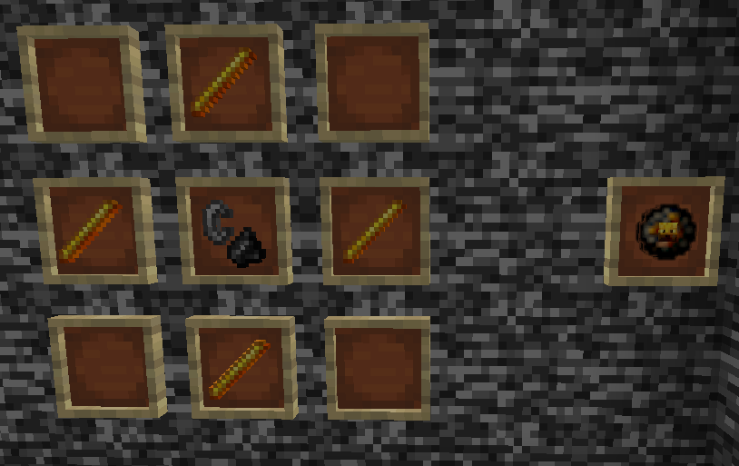

## Flame Blaze

Items required : 4 blaze rod + 1 bow

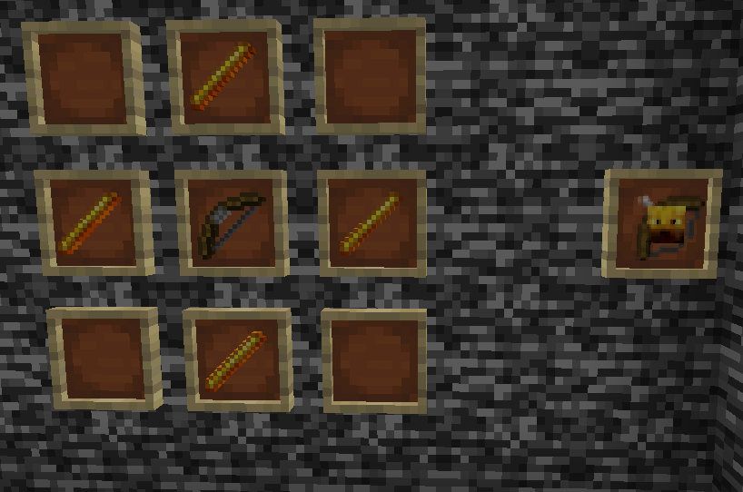

# Example

## Sharpness + Sword

## Sharpness + Sharpness

